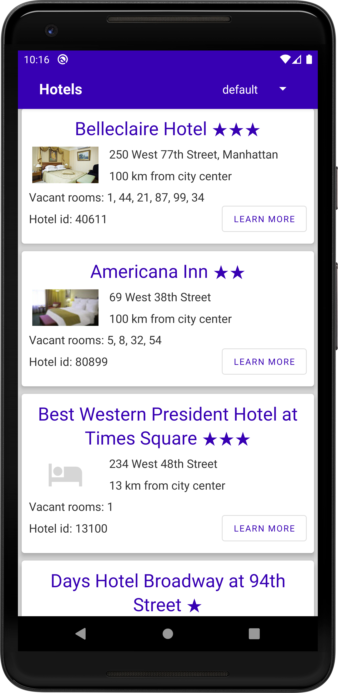
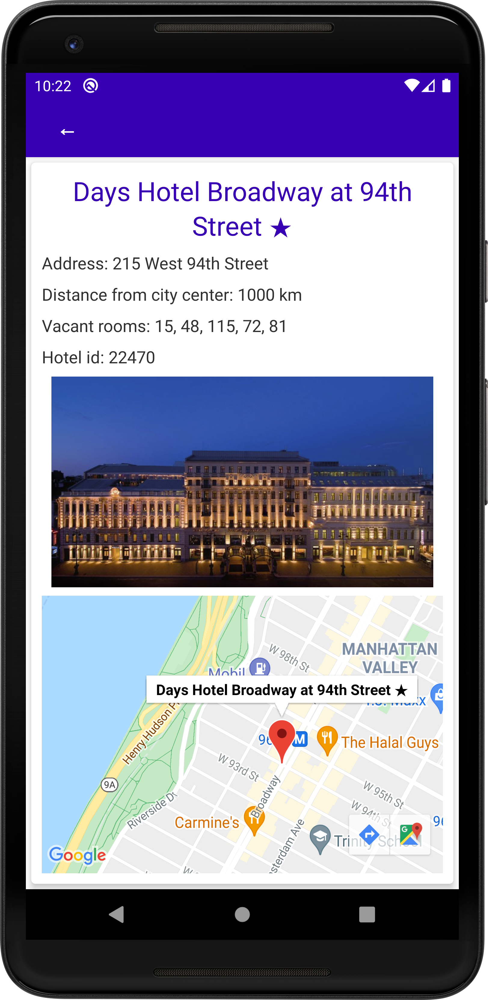
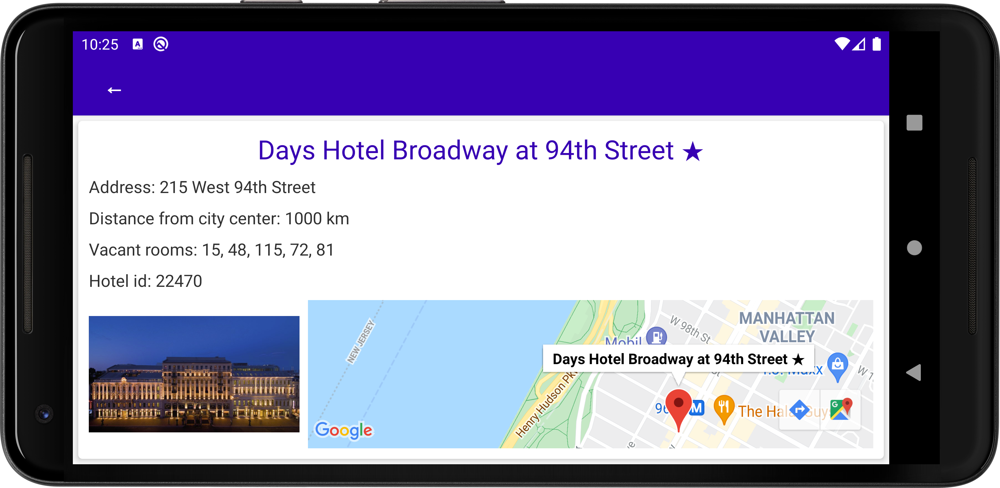

# JsonParserTestTask2

Conditions of the Test task are the same: [JsonParserTestTaskTest](https://github.com/Anette11/JsonParserTestTask#jsonparsertesttask), 
but project architecture is completely redone.

In project are used:

- View Binding to replace findViewById
- Single Activity with SharedViewModel for several Fragments
- Retrofit, Gson, Kotlin Coroutines, Picasso to get and parse data from server.

 

